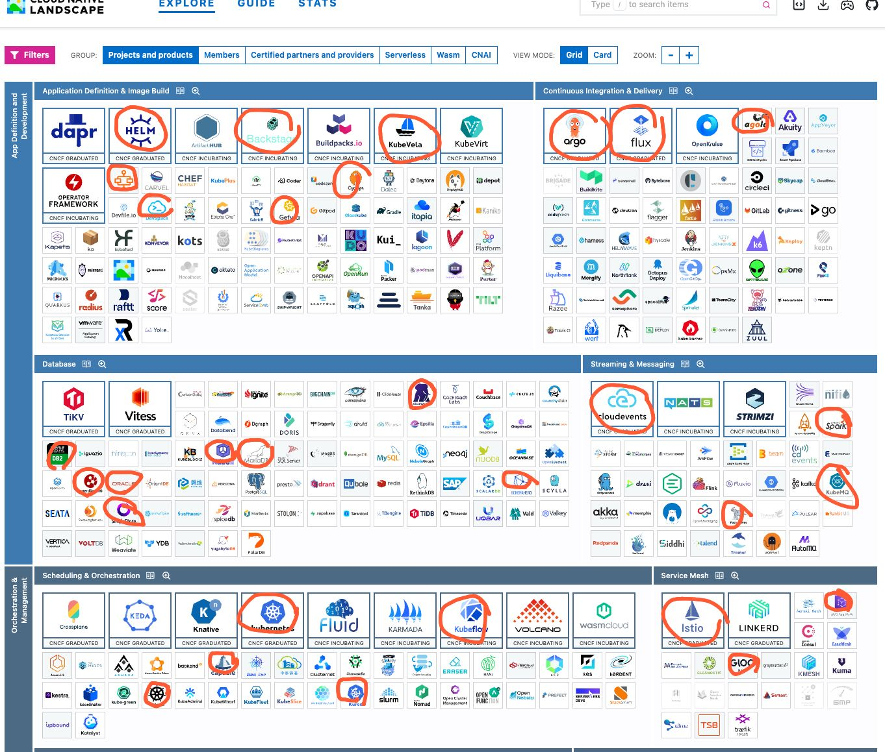
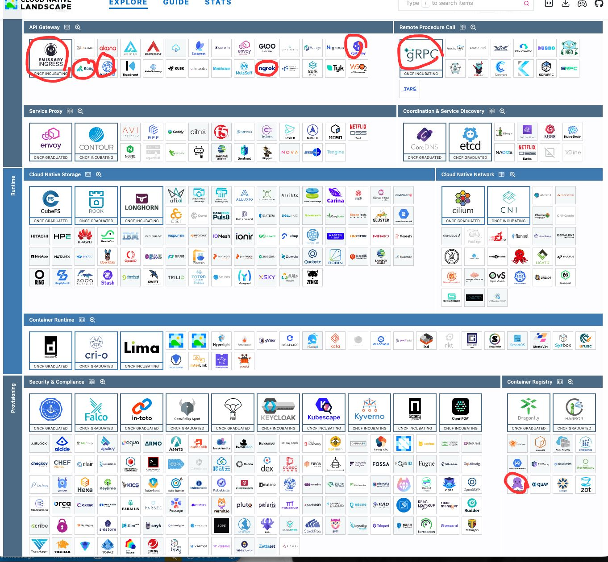

# Exercise 5.8 — CNCF Landscape Usage

## Instructions Summary

From the CNCF Cloud Native Landscape:

- Circle **projects I directly used**
- Use different color for **projects indirectly used (dependencies)**
- Provide a short explanation for each

Images with markings:

- 
- 

---

# Directly Used (circled)

These are tools/services I personally configured, deployed, or wrote code for.

## Kubernetes
Used throughout the entire course to deploy applications, services, CronJobs, Gateway API, scaling, and service mesh.

## Docker
Built and pushed all container images for:
- broadcaster
- log-output
- todo-app
- greeter services

## Helm
Used to install:
- Prometheus
- Istio components
- other cluster add-ons

## Istio
Used in Exercises 5.2–5.3:
- Ambient mode
- Service mesh
- Traffic splitting
- Gateway + HTTPRoute
- Kiali visualization

## Prometheus
Used for monitoring and metrics collection inside the cluster.

## Grafana
Used to visualize Prometheus metrics.

## NATS
Used for messaging between broadcaster services in the log-output project.

## Node.js
Used to implement:
- broadcaster
- greeter
- backend services

## Git
Used for version control of all exercises and manifests.

## GitHub
Used to store repositories and submit exercises.

## k3d
Used to run local Kubernetes clusters for development.

## kubectl
Used daily for:
- deploy
- debug
- port-forward
- logs
- scaling
- rollout restart

---

# Indirectly Used (dependency of something else)

These tools were used internally by other systems, but I did not configure them manually.

## containerd
Used internally by Kubernetes as container runtime.

## CoreDNS
Used automatically by Kubernetes for service discovery.

## Flannel
Used by k3s/k3d as default CNI networking.

## Envoy
Used internally by Istio for service mesh traffic routing.

## etcd
Used internally by Kubernetes for cluster state storage.

## CNI plugins
Used automatically for pod networking.

## kube-proxy
Used internally by Kubernetes for service routing.

---

# Outside of Course (personal projects / prior experience)

## Docker Compose
Used previously for local multi-container development.

## Firebase
Used for mobile app backend (outside course).

## React
Used for personal web dashboard projects.

## ESP32 / Embedded IoT stacks
Used in hardware projects (not CNCF landscape but part of my workflow).

---

# Notes

- Direct use = I installed/configured/wrote code for it
- Indirect use = automatically used by Kubernetes/Istio
- Followed dependencies only to meaningful depth (not every tiny component)

---

# Result

This exercise helped me understand:

- how many CNCF tools I already use daily
- how Kubernetes depends on many hidden components
- how service mesh (Istio) builds on Envoy
- how cloud-native stacks are layered

Total:
- Directly used: ~10–15 tools
- Indirectly used: ~6–8 tools
