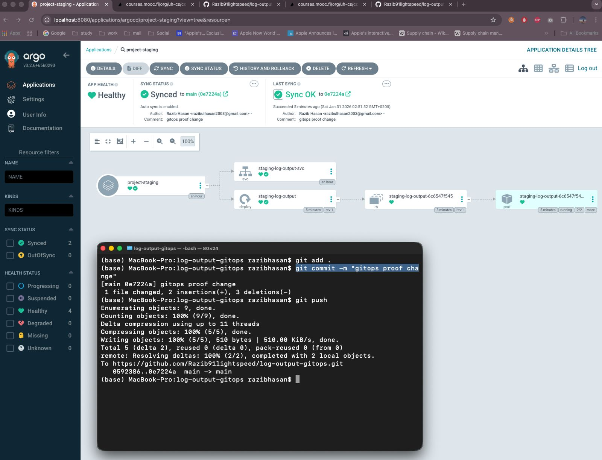

# Exercise 4.10 — Separate GitOps Repository

In this exercise the project was finalized by separating **application code** and **cluster configuration** into different repositories.

## What was done

- A new repository `log-output-gitops` was created
- Only Kubernetes configuration and Kustomize overlays were moved
- ArgoCD applications now point to the GitOps repository
- Staging and production deploy from the config repo
- Application code remains in the original repository
- GitOps repo is the single source of truth for cluster state

This follows GitOps best practice:

> code repo = application  
> config repo = deployment

## Repository structure

```bash
log-output-gitops/
├── base/
└── overlays/
├── staging/
└── production/
```

## Result

- Commits update staging automatically
- Tagged releases update production
- ArgoCD syncs environments independently

## Proof screenshots



# End
